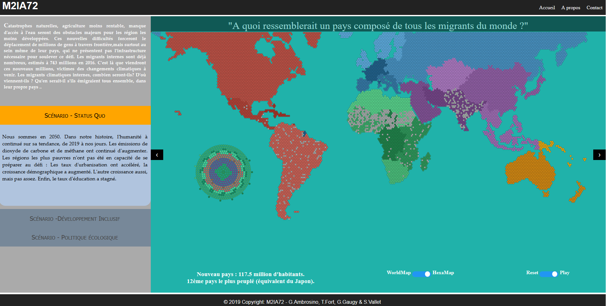

# Présentation

Ce projet a été crée dans le cadre de l'UE de Data Visualisation du Master 2 Inteligence Artificielle de l'Université de Lyon 1.
L'objectif de ce projet est de réaliser une Data Visualisation sur le thême des Données Climatiques.

## Notre Groupe
Nous sommes le groupe 72 entièrement composé d'étudiant du Master 2 IA :
- Gwenael Ambrosino
- Tz'Ayik Fort
- Grégory Gaugy
- Sébastien Vallet

# Le projet

## Sujet choisi
Nous avons décidé de nous orienter sur les flux migratoires humains causés par les changements climatiques : montées des océans, fontes des classes, augmentation de la température...
Nous partons notamment de cet article : [143 millions de "migrants climatiques" potentiels d'ici 2050](https://www.europe1.fr/international/143-millions-de-migrants-climatiques-potentiels-dici-2050-3603704).

## Documents
- [Document de Cadrage du projet](https://m2ia72.github.io/docadrage)

## Visualisation
- [V1.0](https://m2ia72.github.io/Visu1/visu)
- [V2.1.9](https://m2ia72.github.io/Visu2_worldmap/visu_worldmap)
- [V2.1.11](https://m2ia72.github.io/HexMap/index)
- [V3.1.16](https://m2ia72.github.io/HexMapNewCss/finalindex)

